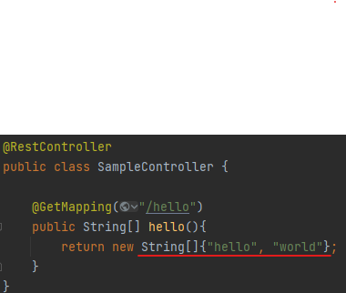
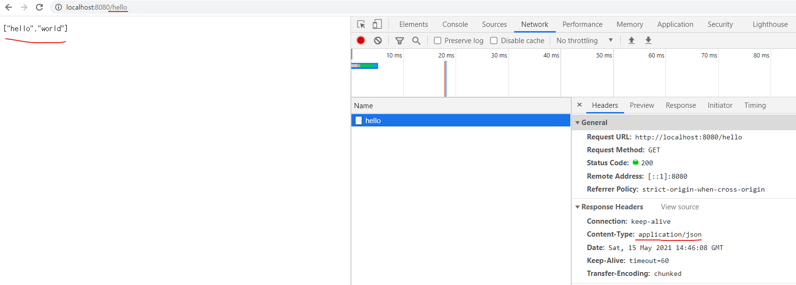
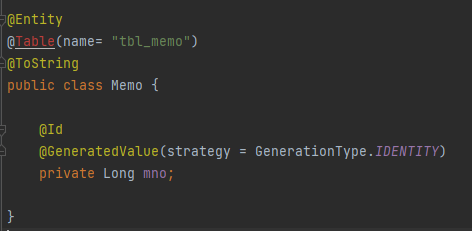
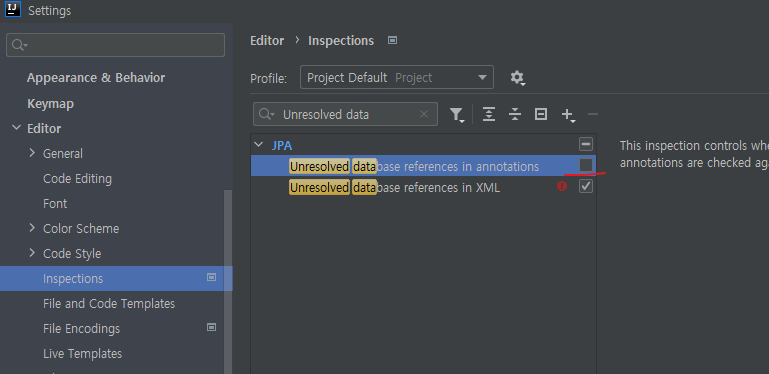
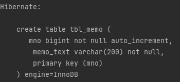
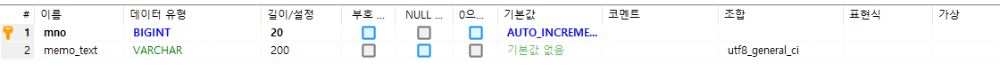

### 스프링 부트 vs 스프링 레거시

* ### json 타입 설정
```
스프링부트 : Spring Web 의존성 1개만 추가
레거시 : jackson-databind 등 추가 별도 설정이 필요함
```


```
JSON 타입이 적용됨을 알수있음
```
--------------
### Spring Data JPA 와 JPA
```
스프링 부트는 JPA의 구현체 중에서 Hibernate라는 구현체를 이용
Hibernate: 오픈소스로 ORM을 지원하는 프레임워크 
```
*스프링에서 DB까지의 연동<br>
Spring Data JPA <> Hibernate <> JDBC <> DB

--------------
### @Table 부분이 빨간줄로 나타나는 에러


<br>
```
[database references in annotations] 체크 해제
개발에 지장이 있지는 않음
```
--------------
### @Entity<br>
```
Spring Data JPA 에서 해당 클래스가 엔티티를 위한 클래스이며
  해당 클래스의 인스턴드들이 JPA로 관리되는 엔티티객체 라는 것을 의미
  ```
  
### @Table<br>
@Entity 와 같이 사용할 수 있으며, 말 그대로 DB상에서 엔티티 클래스를 어떠한 테이블로
  생성할 것인지에 대한 정보를 담기 위한 어노테이션
```
@Table(name="t_memo")로 지정하는 경우
생성되는 테이블의 이름이 t_memo로 생성된다. 인덱스 등 생성하는 설정도 있음
```

### @Id와 @GeneratedValue
```aidl
@Entity가 붙은 클래스는 P.K에 해당하는 특정 필드를 @Id로 지정해야만 함,
@Id가 사용자가 입력하는 값을 사용하는 경우가 아니라면 @GeneratedValue 사용
```
### @GeneratedValue(strategy = GenerationType.IDENTITY)는<br>
```
PK를 자동으로 생성하고자 할 때 사용(키 생성 전략이라고 함)
  만약 DB가 오라클이면 별도의 번호를 위한 별도의 테이블을 생성
  MySQL, MariaDB이면 'Auto increment'를 기본으로 사용해서 레코드가 기록될때마다 다른번호를 가질 수 있도록 처리
``` 

### 키 생성 전략
```aidl
AUTO: JPA 구현체가 생성 방식을 결정
IDENTITY: 사용하는 DB가 키 생성을 MYSQL이나 MariaDB인 경우 auto increment 방식을 이용
SEQUENCE: DB의 시퀀스를 이용해서 키를 생성 @SequenceGenerator와 같이 사용
Table: 키 생성 전용 테이블을 생성, @TableGenerator 와 함께 사용

```
### @Column

추가적인 필드(컬럼)이 필요한 경우 사용
columnDefinition 으로 기본값 지정도 가능
```aidl
@Column(columnDefinition = "varchar(255) default 'YES'")
```
--------------

# JPARepository

(부모) JpaRepository -> PagingAndSortRepository -> CrudRepository -> Repository (자식)<br>
CRUD 작업이나 페이징 정렬 등의 처리도 인터페이스의 메서드를 호출하는 형태로 처리하는데 기능에 따라서
상속 구조로 추가적인 기능을 제공
```
public interface MemoRepository extends JpaRepository<Memo, Long> {
}

>>JpaRepository<'@Entity 타입으로서 해당 어노테이션 선언 된 클래스', 'pk로서 @Id가 선언 된 타입'>

```
-----
### Test 코드를 통한 CRUD
insert // update 작업에 사용하는 메서드가 save()로 동일
이는 JPA의 구현체가 메모리상에서 객체를 비교하고 없다면 insert, 존재하면 update
```aidl
INSERT : save(엔티티 객체)
SELECT : findByid(키 타입), getOne(zl xkdlq)
UPDATE : save(엔티티 객체)
DELETE : deleteByid(키타입), delete(엔티티 객체)
```

```aidl
  //100개의 새로운 Memo객체를 생성하고 memoRepository이용해 insert 테스트
    @Test
    public void testInsertDummies(){

        IntStream.rangeClosed(1,100).forEach(i -> {
            Memo memo = Memo.builder().memoText("Sample..."+i).build();
            memoRepository.save(memo);
        });
    }
```

