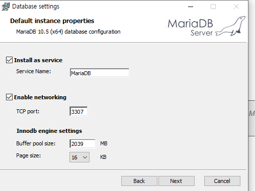
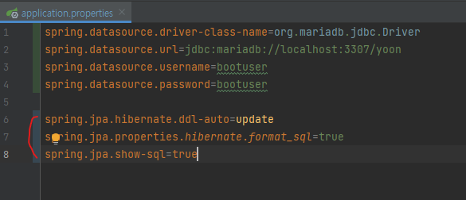

# 환경설정

* JAVA 11
* Maria DB

```
DB 포트 3307
root/root

테이블 접근
bootuser/bootuser
```

 *Spring boot

 *JPA

 spring.jpa.hibernate.ddl-auto=update
```aidl
프로젝트 실행시 자동으로 ddl을 생성 할것인지 결정 
create 경우에 메반 테이블 생성시도, update는 변경이 필요하면 alter, 테이블이 없는 경우 create 
```
spring.jpa.properties.hibernate.format_sql=true
```aidl
실제 JPA 구현체인 hibernate가 동작하면서 발생하는 SQL을 포맷팅해서 출력-> 실행되는 SQL의 가독성을 높여줌
```
spring.jpa.show-sql=true
```aidl
JPA 처리시에 발생하는 SQL을 보여줄 것인지 결정 
```